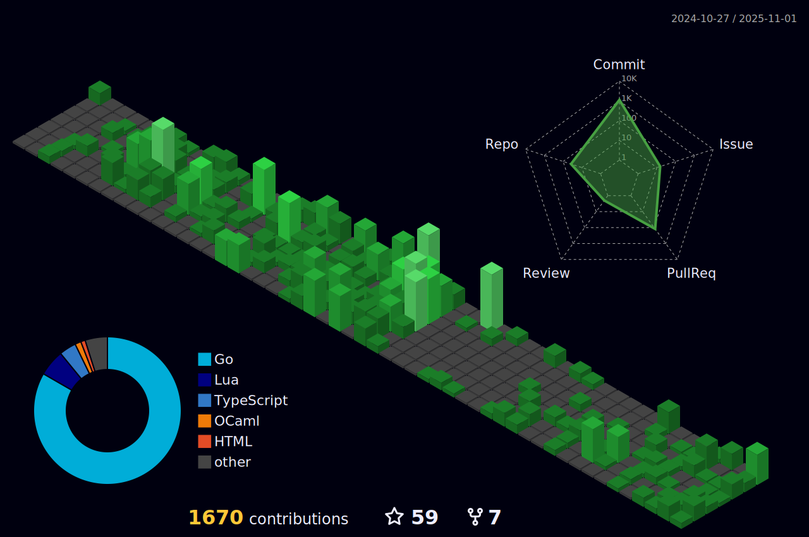

<h3 align="center"><a href="https://bxrne.com">bxrne.com</a></h3>

### About me

Software dev doing MSc ISE (graduating 2026) studying software engineering with industry experience in Industry 4.0 (robotics and computer vision), Radar vision, Manufacturing automation and cloud computing (Pharma 4.0).  - 📚 I'm currently doing my Master's degree in Software Engineering at https://software-engineering.ie - ⚡ In my free time I build rockets https://ulas-hipr.ie and I'm a Notion Campus Leader '24 for the University of Limerick

### Recent

  
  

